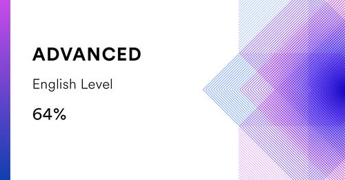

# ***Denis Trukhanovich***  
--------------------------  

### Contacts
------------
* **Phone:** *+375 (33) 622-46-85*
* **Email:** *denis.trukhanovich@gmail.com*
* **GitHub:** *https://github.com/DIvanov1ch*
* **GitLab:** *https://gitlab.com/DIvanov1ch*
* **Discord:** *DIvanov1ch#4213*  

### About me
------------
A detail-oriented Junior, who is eager to absorb information and advice from mentors as a sponge. Looking forward to joining a fast-paced company and use my creativity and experience to improve the overall quality of a product or service.

### Skills
----------
* Java Basics
* JavaScript Basics
* HTML
* CSS
* Git / GitHub / GitLab
* IntelliJ IDEA / VS Code

### Code example
----------------
_The task is to capitalize each word_
>*JavaScript:*
```javascript
String.prototype.toJadenCase = function () {
    return this.split(" ").
            map((word) => word[0].toUpperCase() + word.slice(1)).
            join(" ");
};
```

>*Java:*
```java
public class JadenCase {
    public String toJadenCase(String phrase) {
        if (phrase == null || phrase.length() == 0) {
            return null;
        }
        return Arrays.stream(phrase.split(" ")).
                map((word) -> word.substring(0, 1).toUpperCase() + word.substring(1)).
                collect(Collectors.joining(" "));
    }
}
```

### Education
-------------
* **Brest State Technical University, Brest**
    * Faculty of Mechanical Engineering, Vehicle Maintenance
* **Courses**
    1. Java:
        * [Java Basics 01.2022](https://learn.epam.com)
        * [Java. Fundamentals](https://learn.epam.com)
        * [Java.Classes](https://learn.epam.com)
        * [Java.Strings](https://learn.epam.com)
    2. [Computer Science Basics](https://learn.epam.com)
    3. [Version Control with Git](https://learn.epam.com)
    4. [Puzzle-English/Метод Тичера](https://puzzle-english.com/teacher)

### Projects
------------
*Rolling Scopes School* - project [**"CV"**](https://github.com/rolling-scopes-school/tasks/blob/master/tasks/cv/cv.md)  

### Languages
-------------
* **English** - Upper-Intermediate
    * EPAM Adaptive English test: B2
    * Puzzle English test: Upper-Intermediate (B2)
    * EF SET English Certificate 65/100 (C1 Advanced)
    
* **Russian** - Native
* **Belorussian** - Advanced  